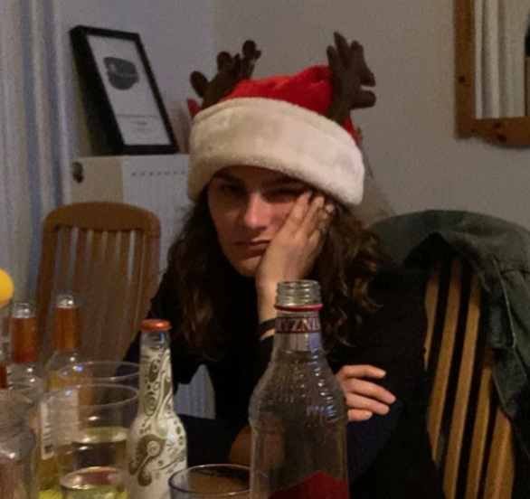
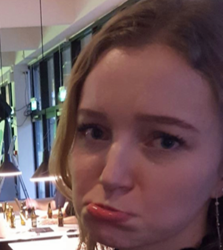

# Hallå, bund lige
<a href="Tiers/bubberteten.html">Bubberteten</a>
## Underbund
<marquee>Kan man hedde Teodora kan man bunde!</marquee>  
  

<marquee>Kan man hedde Laura kan man også bunde!</marquee>  
 

## Den lokale munkeorden

## Bubbertetten 
 

## Sigurds Pilletime

## Drengene på bænken

## Onkel

## Frisk pige
 
## Sydhavngenser
Lukas er her
